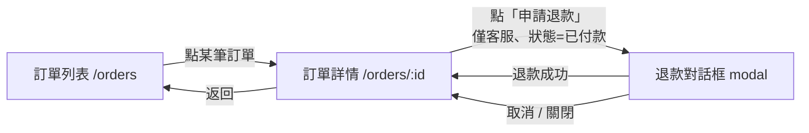

# 示範：screen-map.md（訂單退款 · 前端 · Nuxt 4）

> 完整成品示範，呼應後端 gherkin 的訂單退款例子。實際產出寫到 `specs/<slug>/screens/screen-map.md`。
> 前端棧 Nuxt 4：route = `pages/` 檔案式路由（`/orders` → `pages/orders/index.vue`、`/orders/:id` → `pages/orders/[id].vue`），導航 = `navigateTo` / `<NuxtLink>`。
> 本例假設 `design/` 有 Claude Design 視覺稿；畫面與元素以稿為準，行為 / 權限以 `specify/spec.md` 為準，**UX flow 以稿為準**——下方導航圖作為畫面 ↔ route 的對照地圖。

## 來源對照

- 視覺稿：`design/order-list.html`、`design/order-detail.html`、`design/refund-dialog.html`
- 行為真相：`specify/spec.md`（退款規則、權限：僅客服可退款、狀態機）

## 1. 畫面清單

| 畫面 | route | 進入點 | 需登入 | 視覺稿 |
|---|---|---|---|---|
| 訂單列表 | `/orders` | 側欄「訂單」 | 是 | `design/order-list.html` |
| 訂單詳情 | `/orders/:id` | 列表點某筆 | 是 | `design/order-detail.html` |
| 退款對話框 | modal（掛在 `/orders/:id`） | 詳情點「申請退款」 | 是 | `design/refund-dialog.html` |

## 2. 導航圖

## 3. 各畫面 UI 狀態與元素

### 訂單列表 `/orders`
- **顯示元素**：頁標題、訂單表格（編號 / 客戶 / 金額 / 狀態標籤 / 建立時間）、分頁器
- **可操作元素**：[列] 點某筆訂單 → 詳情
- **UI 狀態**：
  | 態 | 畫面 |
  |---|---|
  | loading | 骨架列表 |
  | empty | 「目前沒有訂單」空狀態 |
  | error | 「載入失敗，重試」 |
  | success | 訂單表格 |
- **權限差異**：一般使用者只看自己的訂單；客服看全部

### 訂單詳情 `/orders/:id`
- **顯示元素**：訂單編號、客戶、金額、狀態標籤、建立時間、退款紀錄區塊（已退款時）
- **可操作元素**：
  - [按鈕] 申請退款（僅客服可見；狀態=「已付款」才 enabled；「已退款」顯示為灰）
  - [按鈕] 返回列表
- **UI 狀態**：
  | 態 | 畫面 |
  |---|---|
  | loading | 骨架卡片 |
  | empty | N/A — 查無即 error/404 |
  | error | 「找不到此訂單」（404） |
  | success | 訂單明細 + 操作按鈕 |
- **權限差異**：非客服不顯示「申請退款」

### 退款對話框（modal）
- **顯示元素**：標題「申請退款」、訂單金額、退款金額輸入框、錯誤訊息區
- **可操作元素**：
  - [輸入] 退款金額（數字）
  - [按鈕] 確認退款 / 取消
- **UI 狀態**：
  | 態 | 畫面 |
  |---|---|
  | loading | 確認鈕轉圈、表單 disabled |
  | error | 表單內顯示錯誤（金額超過訂單金額 / 重複退款），對齊後端錯誤碼 |
  | success | 關閉 modal、回詳情、狀態更新為「已退款」、跳成功 toast |
- **權限差異**：僅客服可達此 modal

## 4. 關鍵 IA 決策（寫進 handoff）

- 退款做成 modal 而非獨立頁（沿用視覺稿）。
- 退款入口的「可見」(權限) 與「可點」(狀態機) 是兩層條件，下游 gherkin 各寫場景。
- 列表分頁細節（每頁筆數）未在 spec.md 定義 → 標 `待釐清` 回報。
