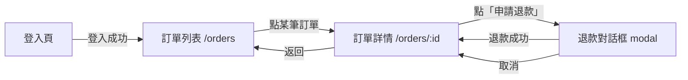

# Sitemap / 導航 flow chart + UI 狀態格式速查

> 配合 `SKILL.md` 的執行步驟。本檔定義 screen-map.md 怎麼畫導航、怎麼標 UI 狀態。
> 前端技術棧為 **Nuxt 4 + TypeScript strict**：畫面即 `pages/` 檔案式路由（`pages/orders/index.vue` → `/orders`、`pages/orders/[id].vue` → `/orders/:id`），導航即 `navigateTo` / `<NuxtLink>`。詳見 `../../pm-to-eng-flow/references/frontend-stack-conventions.md`。
> UX flow 真相：設計師 `design/` HTML 已含 UX flow；本檔的導航 flow chart 在**無 `design/`** 時補位，有稿時作為對照用的 route / 導航地圖。

## 0. 先看 design/ 視覺稿（有就以它為畫面真相）

本團隊流程：設計師先用 **Claude Design 產出視覺稿（HTML/CSS，放 `specs/<slug>/design/`）**，前端再據此開發。所以 screens 階段**不是從零想畫面**：

- **design/ 存在** → 畫面清單、版面、可見元素、狀態以視覺稿為準；`specify/spec.md` 提供行為 / 規則 / 權限。兩者**對照**：
  - 視覺稿有、spec.md 沒提到的畫面 / 元素 → 標 `待釐清:設計稿有 X，需求未提，是否納入？` 回報，**不擅自當定論**。
  - spec.md 要求、視覺稿沒畫的（如某錯誤態）→ 標 `待補設計:X 狀態無對應稿`，仍寫進 screen-map（行為需求優先）。
- **design/ 不存在** → 純從 spec.md 的使用者故事與情境推導畫面（仍照本檔格式）。

> 視覺稿是「長什麼樣」的真相，spec.md 是「該怎麼行為」的真相。screen-map 要同時忠於兩者。

## 1. 畫面清單（先可數、可辨識）

每個畫面一列，標明 route 與進入點：

| 畫面 | route 路徑 | 進入點 | 需登入 |
|---|---|---|---|
| 訂單列表 | `/orders` | 側欄「訂單」 | 是 |
| 訂單詳情 | `/orders/:id` | 列表點某筆 | 是 |
| 退款對話框 | （`/orders/:id` 上的 modal，無獨立 route）| 詳情點「申請退款」 | 是 |

> modal / drawer / 對話框若不獨立成 route，註明「掛在哪個畫面上」。獨立成 route 的才給路徑。

## 2. 導航 flow chart（mermaid flowchart）

> **有 `design/` 視覺稿**：UX flow 以稿為準，本圖可省略重畫或只畫精簡對照地圖（畫面 ↔ route）。
> **無 `design/`**：補畫完整導航 flow chart，作為前端唯一的畫面流程真相。

用 `flowchart` 畫畫面間怎麼走：入口、條件跳轉、返回。節點=畫面，邊=導航動作（`navigateTo` / `<NuxtLink>`）。

規約：
- 邊一律標**觸發動作 / 條件**（`點某筆訂單`、`退款成功`），不要只畫無標籤箭頭。
- modal 用節點表示但備註 `modal`，邊回到母畫面。
- **無死路**（每個非終端畫面都有出口）、**無孤兒**（每個畫面都有入口，除了 app 入口）。

## 3. 每個畫面的 UI 狀態（必標四態 + 權限差異）

對每個「會載入資料」的畫面，逐態描述畫面長相。對齊下游 gherkin 的前端場景。

| 畫面 | loading | empty | error | success | 權限差異 |
|---|---|---|---|---|---|
| 訂單列表 | 骨架列表 | 「目前沒有訂單」空狀態插畫 | 「載入失敗，重試」 | 訂單表格 | 一般使用者只看自己的；客服看全部 |
| 訂單詳情 | 骨架卡片 | （不適用，查無 → error/404） | 「找不到此訂單」 | 訂單明細 + 操作按鈕 | 僅客服可見「申請退款」 |

- **loading / empty / error / success 四態**是預設必標；不適用的態明確標「N/A — 原因」，不要省略不提。
- **權限差異**：同畫面不同角色看到的差異（哪些操作藏起來、哪些資料遮罩）寫清楚——這是下游 gherkin 寫權限場景（401/403）的依據。

## 4. ✅ / ❌

- ✅ 畫面可數、route 明確、導航邊有標籤、四態齊備。
- ✅ modal 標明掛在哪個畫面、回到哪。
- ❌ 導航圖有無標籤的箭頭，或畫面進不去 / 出不來（孤兒 / 死路）。
- ❌ 只畫 success 態，漏 loading / empty / error。
- ❌ 自行新增 spec.md 沒提的畫面（違反非協商規則 #1）。
